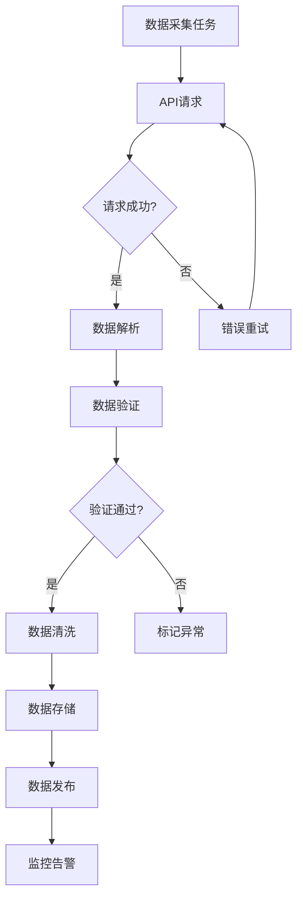

# 数据源配置

## 主要数据源

### 1. 实时行情数据
- **腾讯财经API**: `https://qt.gtimg.cn/q=`
- **新浪财经API**: `https://hq.sinajs.cn/list=`
- **东方财富API**: `https://push2.eastmoney.com/api/`

### 2. 历史数据
- **聚宽JQData**: 需要API密钥
- **Tushare**: 免费开源，有频率限制
- **Baostock**: 免费，数据质量较好

### 3. 基本面数据
- **巨潮资讯网**: 上市公司公告
- **东方财富数据中心**: 财务数据
- **同花顺iFinD**: 专业金融数据（需付费）

### 4. 资金流向
- **东方财富资金流向**: `https://push2.eastmoney.com/api/`
- **新浪资金流向**: `https://vip.stock.finance.sina.com.cn/`

## API配置示例

```javascript
// 腾讯财经API配置
const TENCENT_API = {
  baseUrl: 'https://qt.gtimg.cn/q=',
  stockPrefix: {
    'sh': 'sh',  // 上海
    'sz': 'sz',  // 深圳
    'bj': 'bj'   // 北京（北交所）
  }
};

// 新浪财经API配置
const SINA_API = {
  baseUrl: 'https://hq.sinajs.cn/list=',
  encoding: 'gbk'
};

// 东方财富API配置
const EASTMONEY_API = {
  baseUrl: 'https://push2.eastmoney.com/api/',
  endpoints: {
    realtime: 'qt/stock/get',
    kline: 'qt/stock/kline/get',
    funds: 'qt/stock/fflow/kline/get'
  }
};
```

## 数据采集策略

### 实时数据采集
- 频率: 1-5秒/次
- 并发控制: 最大10个并发请求
- 错误重试: 3次重试，指数退避
- 数据验证: 格式检查、范围检查、一致性检查

### 历史数据采集
- 频率: 每日收盘后
- 数据完整性检查: 检查缺失数据并补全
- 数据清洗: 去除异常值、填充缺失值

### 基本面数据采集
- 频率: 季度财报发布后24小时内
- 数据源验证: 多源交叉验证
- 数据标准化: 统一格式和单位

## 数据质量监控

### 实时监控指标
1. **数据更新延迟**: < 10秒
2. **数据完整性**: > 99.9%
3. **数据准确性**: 多源验证一致率 > 99%
4. **API可用性**: > 99.5%

### 异常检测
- 价格异常波动检测
- 成交量异常检测
- 数据格式异常检测
- 数据源异常检测

## 数据存储策略

### 热数据（Redis）
- 实时行情数据: TTL 60秒
- 技术指标: TTL 300秒
- 资金流向: TTL 60秒

### 温数据（PostgreSQL）
- 日K线数据: 保留5年
- 分钟K线数据: 保留1年
- 基本面数据: 永久保存
- 交易数据: 永久保存

### 冷数据（对象存储）
- 历史K线数据: 5年以上
- 日志数据: 1年以上
- 备份数据: 永久保存

## 数据更新流程



## 数据安全

### 访问控制
- API密钥轮换: 每月一次
- 访问频率限制: 每个IP 1000次/分钟
- 数据加密: HTTPS传输，数据库加密存储

### 数据备份
- 实时备份: 每15分钟增量备份
- 每日备份: 全量备份
- 异地备份: 跨区域备份

## 故障处理

### 数据源故障
1. 切换到备用数据源
2. 记录故障信息
3. 发送告警通知
4. 故障恢复后数据同步

### 数据不一致
1. 暂停数据更新
2. 数据一致性检查
3. 问题数据修复
4. 恢复数据更新

### 性能问题
1. 增加缓存
2. 优化查询
3. 数据分片
4. 负载均衡